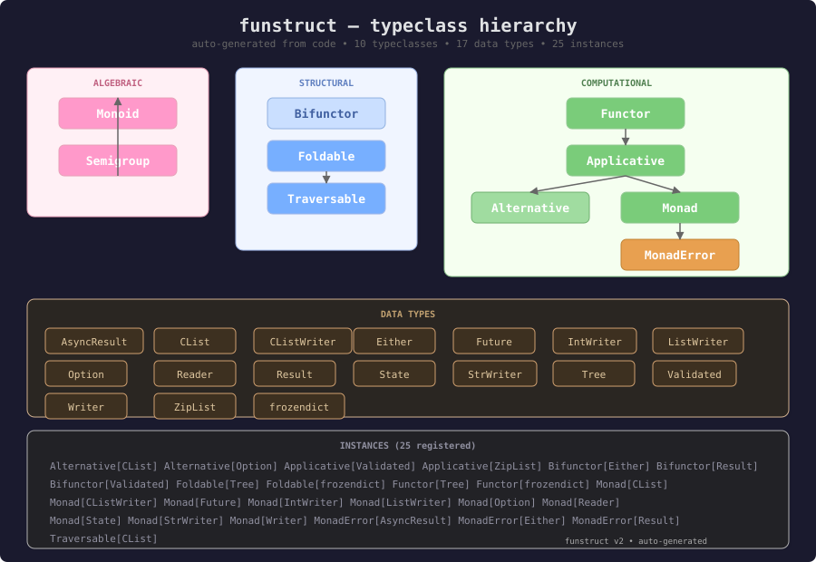

# funstruct

A zero-dependency functional programming library for Python.
Typeclasses, monads, and algebraic data types — influenced by
[Scalaz](https://github.com/scalaz/scalaz) and
[Cats](https://typelevel.org/cats/).

## Install

```bash
pip install funstruct || uv add funstruct
```

## Functional Primer

### Type Class Hierarchy



#### Diagrams

**Functor** — transform the value inside a context

```
F[A] ---( f: A -> B )---> F[B]
```

**Applicative** — apply a function in context to a value in context

```
F[A → B] ─┐
           ├──ap──> F[B]
F[A] ──────┘
```

**Monad** — sequence computations that produce new contexts

```
F[A] ---( f: A -> F[B] )---> F[B]
```

**Semigroup** — associative combine (any type with `+`)

```
A ─┐
    ├──( + )──> A
A ─┘
```

**Monoid** — semigroup with an identity element

```
A ─┐
    ├──( + )──> A       (+ identity = A)
A ─┘
```

```python
# Signatures shown in Python 3.12+ syntax for clarity.
# The library supports Python ≥3.10 (uses TypeVar internally).

@dataclass(frozen=True)
class Semigroup[A]:
    typ: type
    combine: Callable[[A, A], A]

@dataclass(frozen=True)
class Monoid[A](Semigroup[A]):
    empty: A  # identity element

class Functor[A](ABC):
    def map(fa: Functor[A], f) -> Functor[B]: ...

class Applicative[A](Functor[A]):
    def pure(cls, value: A) -> Applicative[A]: ...             # @final on concrete types
    def ap(
        ff: Applicative[Callable[[A], B]],
        fa: Applicative[A],
    ) -> Applicative[B]: ...                                   # F[A→B].ap(F[A]) → F[B]
    def product(
        fa: Applicative[A],
        fb: Applicative[B],
    ) -> Applicative[tuple[A, B]]: ...
    __mul__ = product                                          # * operator

class Alternative[A](Applicative[A]):
    def empty(cls) -> Alternative[A]: ...
    def or_else(fa: Alternative[A], fb: Alternative[A]) -> Alternative[A]: ...

class Monad[A](Applicative[A]):
    def bind(fa: Monad[A], f) -> Monad[B]: ...
    __rshift__ = bind                                          # >> operator

class MonadError[A](Monad[A]):
    def raise_error(cls, error: E) -> MonadError[A]: ...
    def handle_error_with(fa: MonadError[A], f) -> MonadError[A]: ...

class Bifunctor[A, B](ABC):
    def bimap(fa, f, g) -> Bifunctor[C, D]: ...
    def left_map(fa, f) -> Bifunctor[C, B]: ...                # derived
```

```python
# Multiple semigroups for the same type:
int_add = Monoid(typ=int, combine=lambda a, b: a + b, empty=0)
int_mul = Monoid(typ=int, combine=lambda a, b: a * b, empty=1)
```

### Laws

Every implementation must satisfy these mathematical laws:

**Semigroup**

- Associativity: `(a + b) + c == a + (b + c)`

**Monoid**

- Left identity: `empty + a == a`
- Right identity: `a + empty == a`

**Functor**

- Identity: `fa.map(id) == fa`
- Composition: `fa.map(f).map(g) == fa.map(g ∘ f)`

**Applicative**

- Identity: `pure(id).ap(v) == v`
- Homomorphism: `pure(f).ap(pure(x)) == pure(f(x))`
- Interchange: `u.ap(pure(y)) == pure(λf. f(y)).ap(u)`
- Composition: `pure(∘).ap(u).ap(v).ap(w) == u.ap(v.ap(w))`

**Monad**

- Left identity: `pure(a).bind(f) == f(a)`
- Right identity: `m.bind(pure) == m`
- Associativity: `m.bind(f).bind(g) == m.bind(λx. f(x).bind(g))`
